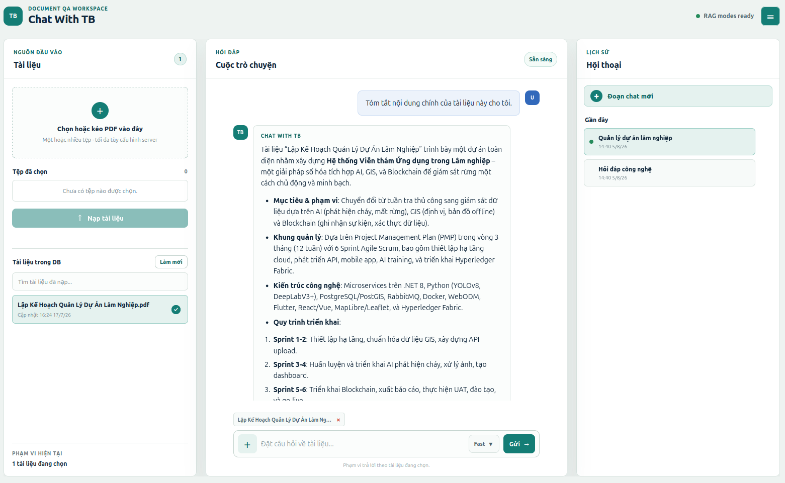

# ChatWithTB v2

ChatWithTB v2 is a Vietnamese document QA chatbot for PDF documents. An upgrade of [ChatWithTB](https://github.com/NguyTroBinh/ChatWithTB). Version 2 focuses on **optimizing retrieval** by combining multiple techniques: hybrid chunking, knowledge graph, retrieval (naive + local + global + deep search), and mandatory citation in every answer.



## Project Structure

```text
app/
├── main.py                         # FastAPI app, static UI, chat/document/conversation APIs
├── core/
│   └── config.py                   # Embedding, Neo4j, LiteLLM, retrieval config
├── ingestion/
│   └── pdf_loader.py               # PDF -> Markdown conversion
├── chunking/
│   └── chunker.py                  # Hybrid Markdown/semantic chunking
├── providers/
│   ├── embedding.py                # Vietnamese embedding service + singleton
│   ├── reranking.py                # Cross-encoder reranker
│   └── litellm_client.py           # LLM adapter via LiteLLM
├── extraction/
│   ├── entity_extractor.py         # LLM entity/relation extraction
│   └── community_builder.py        # Entity graph communities + summaries
├── graph/
│   └── neo4j_store.py              # Document graph, Chunk/Entity/Community indexes
├── retrieval/
│   ├── naive.py                    # Chunk vector + fulltext search, RRF merge
│   └── local.py                    # Entity-scoped graph retrieval
├── reasoning/
│   ├── answer_generator.py         # Grounded answer generation
│   └── deepsearch.py               # Planner-based sub-query search
├── pipeline/
│   ├── ingest.py                   # PDF -> chunks -> embeddings -> Neo4j
│   ├── naive_chat.py               # Fast mode pipeline
│   ├── local_chat.py               # Balanced mode pipeline
│   └── graph_builder.py            # Graph extraction pipeline
└── memory/
    ├── config.py                   # Redis and long-term memory config
    ├── shortterm.py                # Redis session history + conversation metadata
    └── longterm/
        ├── core.py                 # MemoryCore facade
        ├── neo4j_memory_store.py   # :Memory and :MemoryEntity storage
        ├── recall.py               # Vector + keyword + relation/entity expansion
        ├── enrichment.py           # LiteLLM background enrichment
        ├── consolidation.py        # Memory decay/archive helpers
        └── scheduler.py            # Consolidation scheduler

web/                                # HTML/CSS/JS chat UI
prompts/                            # Vietnamese prompts
data/raw/pdf/                       # Uploaded PDFs
data/processed/                     # Converted Markdown files
scripts/                            # Lightweight self-check scripts
docker-compose.yml                  # Neo4j, Redis, Redis Insight
```

## Techniques

### Hybrid Chunking (5 steps)

1. **Table isolation** — Detect Markdown tables, isolate with `\n\n` to prevent splitting mid-table.
2. **Markdown header split** — Split by heading structure (H1/H2/H3), preserve section metadata.
3. **Structure split** — Chunks > 1200 tokens are further split by natural separators (paragraph, numbered list).
4. **Smart merge** — Chunks < 200 tokens are force-merged; chunks < 700 tokens are merged if same topic.
5. **Semantic split** — Remaining large chunks are split by SemanticChunker (gradient breakpoint) based on embedding similarity.

### Knowledge Graph (Neo4j)

Neo4j stores `Document`, `Chunk`, `Entity`, and `Community` nodes. The system creates vector and fulltext indexes for document chunks and graph nodes, then uses LLM-based extraction to build entity relationships and community summaries.

### Retrieval

- **Fast mode**: Chunk vector search + chunk fulltext search -> RRF merge -> rerank -> answer.
- **Balanced mode**: Entity vector/fulltext search scoped by selected documents -> mention chunks + neighbor chunks + relationship/community context -> rerank -> answer.
- **Deep mode**: LiteLLM planner decomposes the user query into up to 3 sub-queries, runs each sub-query through naive retrieval, reranks per sub-query, deduplicates chunks, and synthesizes the final answer.

All chat modes are document-scoped: retrieval only runs within the active uploaded/selected documents.

### Memory

- **Short-term memory**: Redis stores the latest 50 messages per `session_id` and conversation metadata such as title, document scope, created time, and updated time.
- **Long-term memory**: Neo4j stores session-scoped `:Memory` and `:MemoryEntity` nodes with vector embeddings, keyword recall, relation expansion, and entity expansion.
- **Enrichment**: After each QA exchange, a background worker calls LiteLLM to classify memory type, extract memory entities, create entity-entity and memory-memory relationships, and mark the memory as processed.
- **Consolidation scheduler**: A background scheduler periodically runs memory maintenance jobs and persists run history in Neo4j via `ConsolidationControl` and `ConsolidationRun` nodes.
- **Decay**: Runs daily by default. Old memories that have not been accessed gradually lose `importance`, while protected types such as `Decision` and `Insight` or high-importance memories are skipped.
- **Creative consolidation**: Runs weekly by default. Similar memories with the same type are synthesized into an `Insight` meta-memory, linked back to source memories with `DERIVED_FROM`.
- **Cluster consolidation**: Runs monthly by default. Memories with many `SIMILAR_TO` neighbors are grouped into cluster meta-memories, with members linked through `PART_OF`.
- **Forget**: Disabled by default. When archive/delete thresholds are configured, low-importance old memories can be archived or deleted after the grace period, while protected memory types are skipped.

### Provider-switchable LLM

LiteLLM is used as the LLM adapter, so the project can connect to providers such as NVIDIA NIM, OpenAI-compatible APIs, Ollama, Gemini, vLLM, and others.

## Installation and Usage

### Requirements

- Python 3.12+
- Docker and Docker Compose
- Neo4j 5.x
- Redis
- A LiteLLM-compatible LLM endpoint/API key

### 1. Clone and Install

```bash
git clone https://github.com/NguyTroBinh/ChatWithTBv2.git
cd ChatWithTBv2

python -m venv .venv
source .venv/bin/activate
pip install -r requirements.txt
```

### 2. Configure Environment

```bash
cp .env.example .env
```

Update `.env` with your model/API settings:

### 3. Start Infrastructure

```bash
docker compose up -d neo4j redis redis-insight
```

Useful URLs:

- Neo4j Browser: `http://localhost:7474`
- Redis Insight: `http://localhost:5540`

When adding Redis in Redis Insight, use:

```text
Host: redis
Port: 6379
```

### 4. Run the App

```bash
.venv/bin/python -m uvicorn app.main:app --host 0.0.0.0 --port 8000
```

Open:

```text
http://localhost:8000
```

### 5. Use the Chat UI

1. Upload one or more PDF files, or select existing documents from the DB.
2. Create or open a conversation from the history sidebar.
3. Choose a chat mode: `Fast`, `Balanced`, or `Deep`.
4. Ask questions in Vietnamese. Answers are generated only from the active document scope.

## Future Plans

- Better global search over communities.
- More robust evaluation for Deep Search sufficiency.
- Caching for embeddings, retrieval results, and generated answers.
